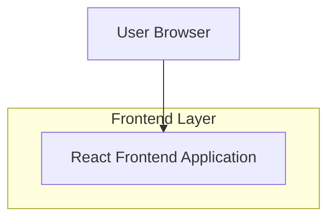

## 1.Architecture design

## 2.Technology Description
- Frontend: React@18 + vite + tailwindcss@3
- Backend: None (site estático)

## 3.Route definitions
| Route | Purpose |
|-------|---------|
| / | Página Inicial com mensagem principal e atalhos |
| /historia | Página “Nossa História” (linha do tempo do namoro) |
| /galeria | Página “Galeria” (fotos + lightbox) |
