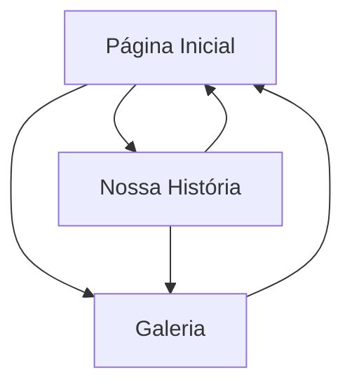

## 1. Product Overview
Site temporário (1 mês) para celebrar 1 ano de namoro de Rafael e Ana Clara Braga.
Reúne uma homenagem visual (fotos) e narrativa (história) em um endereço simples de compartilhar.

## 2. Core Features

### 2.1 User Roles
| Papel | Método de acesso | Permissões principais |
|------|------------------|----------------------|
| Visitante | Link direto (sem login) | Pode navegar entre páginas, ler conteúdo e ver fotos |

### 2.2 Feature Module
O site consiste nas seguintes páginas principais:
1. **Página Inicial**: mensagem principal, destaques (marcos), atalhos para História e Galeria.
2. **Nossa História**: linha do tempo com momentos marcantes e textos curtos.
3. **Galeria**: grid de fotos com visualização ampliada (lightbox) e legendas.

### 2.3 Page Details
| Page Name | Module Name | Feature description |
|-----------|-------------|---------------------|
| Página Inicial | Hero comemorativo | Exibir título (1 ano), nomes (Rafael e Ana Clara Braga) e uma frase curta de homenagem |
| Página Inicial | Destaques do ano | Mostrar 3–6 marcos (ex.: “primeiro encontro”, “primeira viagem”) em cards com data e texto curto |
| Página Inicial | CTA e navegação | Direcionar para “Nossa História” e “Galeria” com botões/links evidentes |
| Página Inicial | Seção final | Exibir uma mensagem mais longa (mini-carta) e assinatura (Rafael / Ana Clara, conforme desejado) |
| Nossa História | Linha do tempo | Contar a história em ordem cronológica com datas, títulos e parágrafos curtos |
| Nossa História | Blocos de momentos | Exibir 6–12 momentos em seções repetíveis (texto + foto opcional) |
| Nossa História | Encerramento | Fechar com um “brinde ao futuro” (texto curto) e link para Galeria |
| Galeria | Grid de fotos | Listar fotos em grade responsiva com carregamento otimizado |
| Galeria | Visualização ampliada | Abrir foto em modal/lightbox com navegação anterior/próxima |
| Galeria | Legendas | Exibir legenda curta por foto (local, data ou frase) |

## 3. Core Process
**Fluxo do Visitante (padrão)**
1. Você acessa o link e cai na Página Inicial com a homenagem principal.
2. Você escolhe seguir para “Nossa História” para ler os marcos do relacionamento.
3. Você abre “Galeria” para ver as fotos e pode ampliar para ver detalhes.
4. Você retorna para a Página Inicial para reler a carta final e compartilhar o link.

